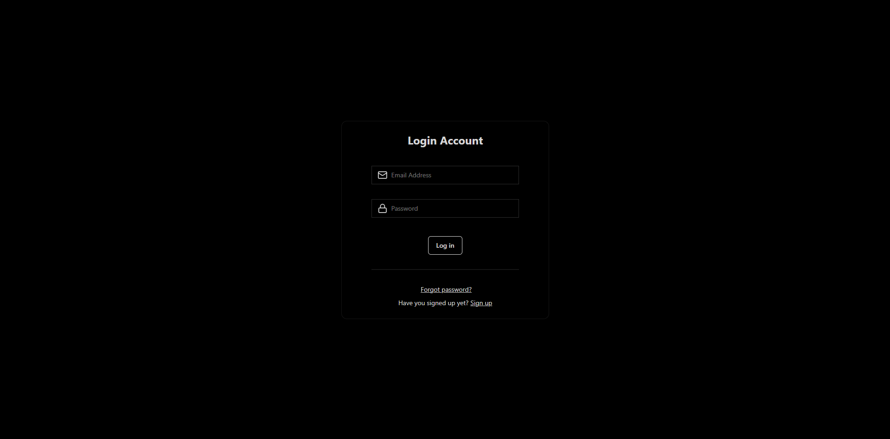
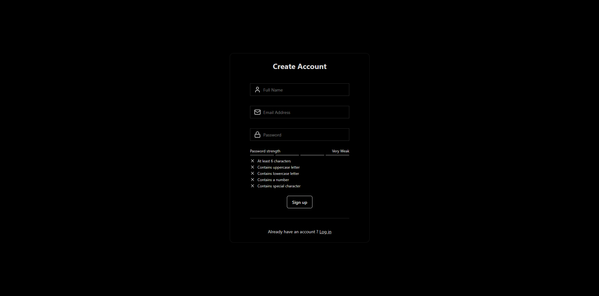
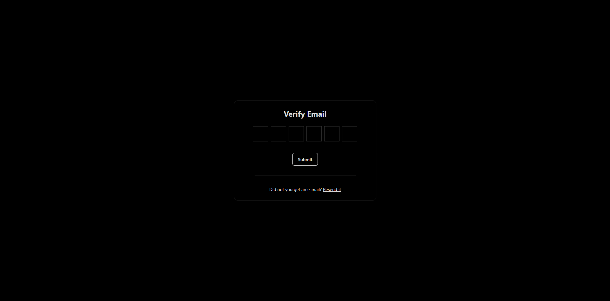
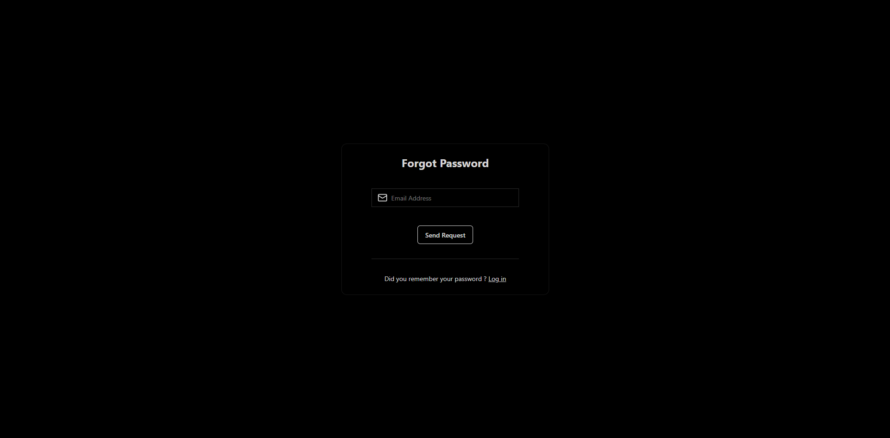
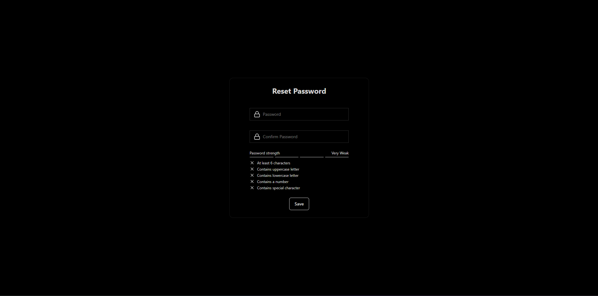

# MERN: Advanced Auth App | JWT, Rate-Limiter, Validators

💻 **Sign Up:** Easily create an account with a full name, email, and password.

🔑 **Log In:** Secure login system.

✉️ **Email Verification:** Send an activation link via email to verify the account.

🔄 **Resend Email:** Option to resend the verification link if it doesn't arrive.

❓ **Forgot Password:** Request a password reset link via email.

🔒 **Reset Password:** Secure password reset page using a token.

✅ **Form Validation:** User-friendly forms with real-time error messages.

⏳ **Loading Animations:** Spinners to inform users during processing.

🛡️ **JWT Token:** JSON Web Token for session management.

🍪 **Cookie-Based Auth:** Secure session storage using cookies.

📧 **Email Integration:** Sending password reset and verification emails.

🚦 **Route Protection:** Middleware to prevent unauthorized access.

🕒 **Token Expiry:** Password reset links expire after a certain time.

📊 **Toast Notifications:** Real-time pop-ups for operation results.


## Technologies Used

**Frontend:** React, Zustand, Tailwind CSS, DaisyUI

**Backend:** Node.js, Express.js, Mongoose

**Database:** MongoDB

## Screenshots








## Environment Variables

To run this project you will need to add the following environment variables to your .env file.

```
MONGODB_URI=
CLIENT_URL=
PORT=
JWT_SECRET=
RESEND_API_KEY=
NODE_ENV=production (optional)
```

